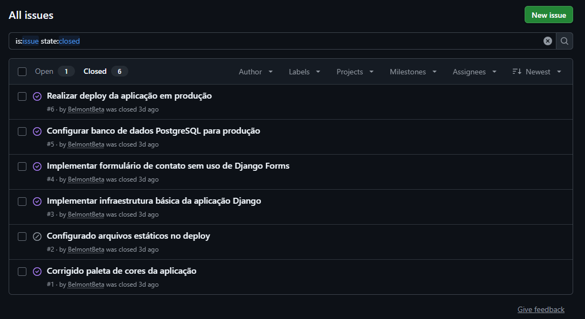
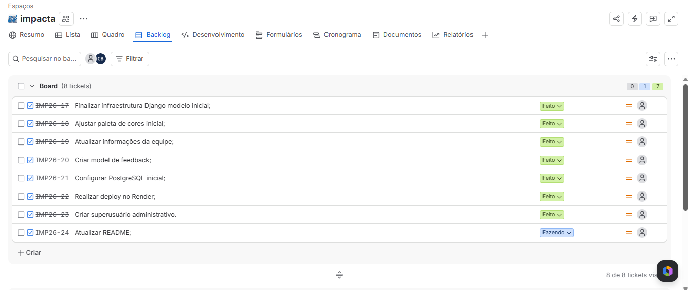
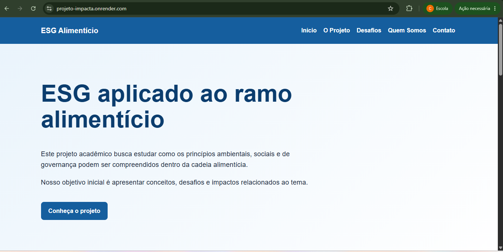
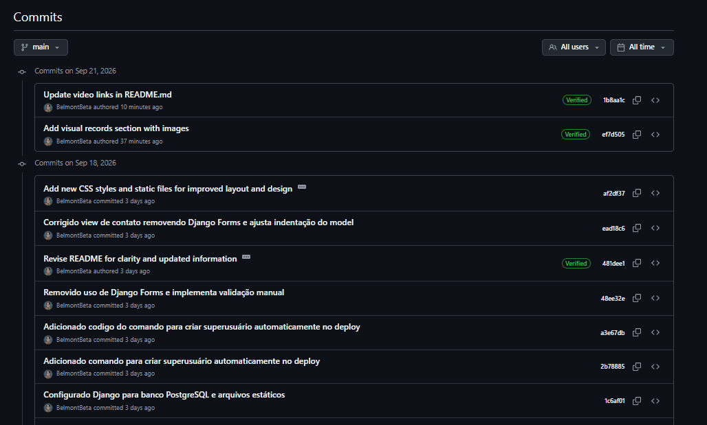
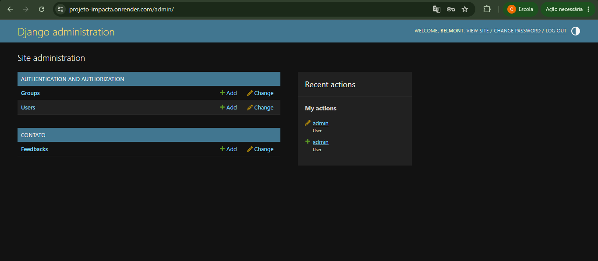

# Projeto Impacta 🚀

Solução web de impacto e inovação voltada à gestão ESG para pequenas e médias empresas do setor alimentício.

---

## 📝 Descrição do Projeto

O Projeto Impacta é uma aplicação web desenvolvida na disciplina **Projetos 2**, da **CESAR School**, com o objetivo de apresentar soluções relacionadas à sustentabilidade, impacto social e inovação no setor alimentício.

A aplicação foi desenvolvida utilizando o framework Django e possui páginas informativas sobre ESG, desafios do setor, equipe do projeto e um formulário de contato para envio de feedbacks.

O projeto também foi publicado em ambiente de produção utilizando o Render.

---

## 🎯 Objetivos Principais

- Desenvolver uma solução web com foco em impacto social e empresarial;
- Aplicar conceitos de sustentabilidade no setor alimentício;
- Apresentar informações sobre práticas ESG;
- Permitir o envio e armazenamento de feedbacks;
- Aplicar conceitos de desenvolvimento web com Python e Django;
- Utilizar controle de versão com Git e GitHub;
- Aplicar metodologias ágeis durante o desenvolvimento;
- Publicar a aplicação em ambiente de produção.

---

## 🛠️ Tecnologias Utilizadas

| Tecnologia | Utilização |
|---|---|
| Python | Linguagem principal do projeto |
| Django | Framework web utilizado no desenvolvimento |
| HTML | Estrutura das páginas |
| CSS | Estilização e responsividade |
| SQLite | Banco de dados utilizado no desenvolvimento local |
| PostgreSQL | Banco de dados utilizado em produção |
| Gunicorn | Servidor WSGI da aplicação |
| WhiteNoise | Gerenciamento de arquivos estáticos em produção |
| Git | Controle de versão |
| GitHub | Repositório e gerenciamento de Issues |
| Jira | Organização das atividades e Sprint |
| Render | Hospedagem da aplicação |

---

## 📌 Funcionalidades

- Página inicial com apresentação do projeto;
- Página sobre o Projeto Impacta;
- Página com desafios relacionados ao ESG;
- Página com informações da equipe;
- Formulário de contato;
- Validação manual dos dados enviados pelo formulário;
- Armazenamento dos feedbacks no banco de dados;
- Painel administrativo do Django;
- Layout responsivo;
- Paleta de cores em tons de azul;
- Aplicação publicada em ambiente de produção.

A aplicação foi desenvolvida sem o uso de Generic Views e sem Django Forms, conforme orientação da disciplina. O formulário utiliza HTML, `request.POST` e validações implementadas manualmente na view.

---

## 🌐 Acesso à Aplicação

A aplicação está disponível em produção:

[https://projeto-impacta.onrender.com](https://projeto-impacta.onrender.com)

### Painel administrativo

O painel administrativo pode ser acessado em:

[https://projeto-impacta.onrender.com/admin/](https://projeto-impacta.onrender.com/admin/)

O acesso é restrito ao usuário administrador configurado no ambiente de produção.

Por motivos de segurança, a senha não é disponibilizada neste documento.

---

## 📁 Estrutura Principal do Projeto

```text
projeto-impacta/
├── config/
│   ├── __init__.py
│   ├── settings.py
│   ├── urls.py
│   ├── asgi.py
│   └── wsgi.py
├── core/
│   ├── management/
│   │   └── commands/
│   │       └── criar_admin.py
│   ├── templates/
│   └── ...
├── contato/
│   ├── migrations/
│   ├── templates/
│   │   └── contato/
│   ├── admin.py
│   ├── models.py
│   ├── urls.py
│   ├── views.py
│   └── ...
├── static/
│   └── css/
│       └── style.css
├── docs/
│   ├── github-issues.png
│   ├── sprint-02.png
│   ├── deploy-render.png
│   ├── commits-main.png
│   └── admin-feedback.png
├── manage.py
├── requirements.txt
└── README.md
```

---

## ▶️ Como Rodar o Projeto Localmente

### Pré-requisitos

- Python 3.8 ou superior;
- Git;
- pip.

### 1. Clonar o repositório

```bash
git clone https://github.com/BelmontBeta/projeto-impacta.git
cd projeto-impacta
```

### 2. Criar o ambiente virtual

No Windows:

```bash
python -m venv venv
```

### 3. Ativar o ambiente virtual

No Windows PowerShell:

```powershell
.\venv\Scripts\Activate.ps1
```

No Prompt de Comando:

```cmd
venv\Scripts\activate
```

### 4. Instalar as dependências

```bash
pip install -r requirements.txt
```

### 5. Executar as migrações

```bash
python manage.py migrate
```

### 6. Verificar o projeto

```bash
python manage.py check
```

### 7. Iniciar o servidor

```bash
python manage.py runserver
```

A aplicação ficará disponível em:

[http://127.0.0.1:8000/](http://127.0.0.1:8000/)

---

## 🚀 Deploy

O deploy da aplicação foi realizado utilizando o Render.

### Build Command

```bash
pip install -r requirements.txt && python manage.py collectstatic --noinput && python manage.py migrate && python manage.py criar_admin
```

### Start Command

```bash
gunicorn config.wsgi:application
```

### Variáveis de ambiente

As principais variáveis utilizadas em produção são:

```text
SECRET_KEY
DEBUG
ALLOWED_HOSTS
CSRF_TRUSTED_ORIGINS
DATABASE_URL
DJANGO_SUPERUSER_USERNAME
DJANGO_SUPERUSER_EMAIL
DJANGO_SUPERUSER_PASSWORD
```

As informações sensíveis não são armazenadas no código-fonte nem no repositório público.

---

## 🧪 Testes Realizados

Foram realizados testes locais e em ambiente de produção.

| Teste | Resultado |
|---|---|
| Verificação do projeto com `python manage.py check` | Aprovado |
| Execução das migrações | Aprovado |
| Coleta de arquivos estáticos | Aprovado |
| Inicialização do servidor local | Aprovado |
| Abertura da página inicial | Aprovado |
| Navegação entre as páginas | Aprovado |
| Exibição da página da equipe | Aprovado |
| Aplicação da paleta azul | Aprovado |
| Abertura do formulário de contato | Aprovado |
| Validação de campos obrigatórios | Aprovado |
| Envio de feedback | Aprovado |
| Armazenamento do feedback no banco de dados | Aprovado |
| Acesso ao painel administrativo | Aprovado |
| Visualização dos feedbacks no painel administrativo | Aprovado |
| Funcionamento dos arquivos estáticos em produção | Aprovado |
| Acesso à aplicação publicada no Render | Aprovado |

---

## 🎨 Alterações Visuais

A paleta de cores original foi alterada de tons verdes para tons de azul.

As principais variáveis utilizadas no CSS são:

```css
:root {
    --azul-principal: #155e9e;
    --azul-escuro: #0b3d6e;
    --azul-claro: #eaf4fc;
    --texto: #1e293b;
    --cinza: #f4f7fb;
    --branco: #ffffff;
    --borda: #d8e3ef;
}
```

A alteração foi aplicada ao:

- Cabeçalho;
- Menu de navegação;
- Botões;
- Rodapé;
- Títulos;
- Cards;
- Bordas;
- Gradiente da página inicial;
- Mensagens de sucesso;
- Campos do formulário.

---

## 👥 Membros da Equipe

| Nome completo | E-mail CESAR School | Função |
|---|---|---|
| Caio Henrique de Sena Belmont | chsb@cesar.school | Desenvolvimento e documentação |
| Caio Freitas de Andrade Medeiros | cfam@cesar.school | Desenvolvimento |
| Gabriel Cassemiro Romualdo Filgueira Pino | gcrfl@cesar.school | Desenvolvimento |
| Gabriel Furtado Correia Miller | gfcm@cesar.school | Desenvolvimento |
| Jose Henrique Carneiro Lapa | jhcl@cesar.school | Desenvolvimento |
| João Pedro Guedes Alcoforado Carneiro Leão | jpgacl@cesar.school | Desenvolvimento |

---

## 📋 Entrega 01

### Descrição

Análise de concorrência e benchmarking de soluções relacionadas à gestão ESG e sustentabilidade.

### Documento

[Análise de concorrência](https://github.com/BelmontBeta/projeto-impacta/blob/main/analise-concorrencia.md)

### Registros visuais

- Painel inicial
  
- Painel Backlog
  

### Data

31/08/2026

---

## 📋 Entrega 02

### Descrição

Desenvolvimento, testes, documentação e publicação da aplicação web Projeto Impacta.

### Atividades realizadas

- Atualização das informações da equipe;
- Implementação das páginas da aplicação;
- Implementação do formulário de contato;
- Validação manual dos dados enviados;
- Armazenamento dos feedbacks no banco de dados;
- Configuração do painel administrativo;
- Correção da paleta de cores para tons de azul;
- Configuração dos arquivos estáticos;
- Configuração do banco de dados de produção;
- Publicação da aplicação no Render;
- Criação do acesso administrativo;
- Realização dos testes locais e em produção;
- Atualização do README;
- Organização das tarefas no Jira;
- Registro e acompanhamento de issues no GitHub.

### Data

18/09/2026

---

## 🐛 Issues e Bug Tracker

O acompanhamento de tarefas, problemas e correções foi realizado por meio do GitHub Issues.

Acesse o bug tracker:

[GitHub Issues do Projeto Impacta](https://github.com/BelmontBeta/projeto-impacta/issues)

### Evidência



---

## 📅 Sprint 02

A Sprint 02 foi utilizada para organizar as atividades de desenvolvimento, testes, documentação e publicação do sistema.

### Principais tarefas

- Finalizar a infraestrutura Django;
- Atualizar as informações da equipe;
- Corrigir a paleta de cores;
- Implementar o formulário de contato;
- Implementar o armazenamento de feedbacks;
- Configurar o painel administrativo;
- Configurar o banco PostgreSQL;
- Configurar os arquivos estáticos;
- Realizar o deploy no Render;
- Criar o superusuário administrativo;
- Realizar os testes em produção;
- Atualizar a documentação;
- Gravar os vídeos da entrega.

### Quadro da Sprint

[Quadro da Sprint 02 no Jira](https://projetos-fds-cesar.atlassian.net/jira/software/projects/IMP26/boards/34/backlog)

### Evidência



---

## 🎥 Vídeos da Entrega

### Vídeo de utilização do sistema

O vídeo demonstra:

- Acesso à aplicação publicada;
- Navegação pelas páginas;
- Visualização da equipe;
- Acesso ao formulário de contato;
- Envio de um feedback;
- Acesso ao painel administrativo;
- Visualização do feedback armazenado.

[Vídeo de utilização do sistema](https://youtu.be/WyNH5URHsVQ)

### Vídeo de explicação do código

O vídeo explica:

- Estrutura do projeto Django;
- Arquivo `config/urls.py`;
- Rotas da aplicação;
- Funcionamento das views;
- Uso de `request.POST`;
- Validação manual dos dados;
- Model utilizado para persistência;
- Templates HTML;
- Arquivos estáticos;
- Configuração do deploy;
- Acesso ao painel administrativo.

[Vídeo de explicação do código](https://youtu.be/1NUkU0zcdG0)

---

## 📸 Evidências da Entrega

### Aplicação publicada



### Histórico de commits



### Painel administrativo



### Issues do GitHub


### Sprint 02


---

## 🔀 Versionamento

O projeto utiliza Git e GitHub para controle de versão.

Repositório:

[Repositório do Projeto Impacta](https://github.com/BelmontBeta/projeto-impacta)

As alterações foram organizadas por meio de commits relacionados às funcionalidades e etapas do projeto, incluindo:

- Atualização da equipe;
- Correção da paleta de cores;
- Implementação do formulário;
- Configuração do banco de dados;
- Configuração do deploy;
- Criação do superusuário;
- Atualização da documentação;
- Realização dos testes finais.

A versão publicada está disponível na branch `main`.

---

## 📞 Contato

Para dúvidas ou sugestões sobre o projeto, entre em contato com um dos membros da equipe.

---

**Última atualização:** 18/09/2026
